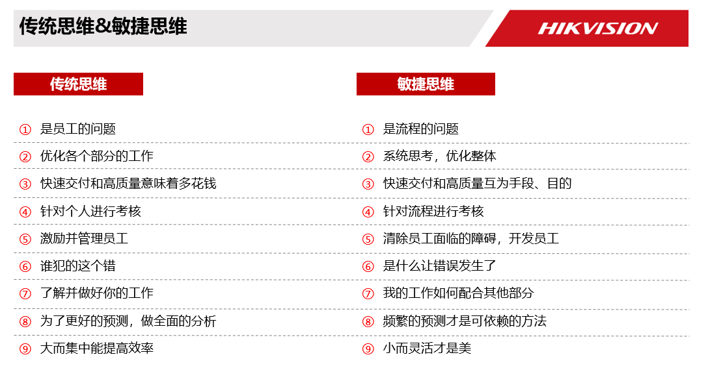
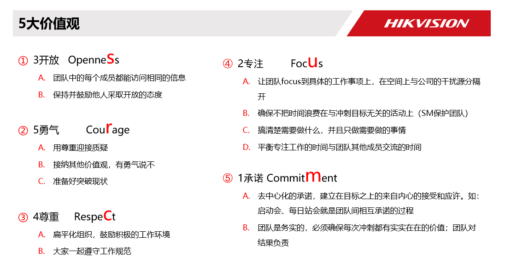

敏捷宣言，也叫做敏基础捷软件开发宣言，正式宣布了对四种核心价值和十二条原则，可以指导迭代的以人为中心的软件开发方法。因互联网的发展，敏捷方法变得越来越流行，越来越实用，掌握敏捷方法对每一个职场人而言，迫在眉睫。

**敏捷价值观(重点)**

我们一直在实践中探寻更好的软件开发方法，身体力行的同时也帮助他人。由此我们建立了如下价值观：

1. 个体和互动 高于 流程和工具
2. 工作的软件 高于 详尽的文档
3. 客户合作 高于 合同谈判
4. 响应变化 高于 遵循计划

也就是说，尽管右项有其价值，我们更重视左项的价值。

**敏捷12原则(重点)**

①Value-交付价值 我们最重要的目标，通过尽早和持续不断地交付有价值的软件来满足客户；

②Change-拥抱变更 即使在项目开发的后期，仍欢迎对需求提出变更，敏捷过程通过拥抱变化，帮助客户获得竞争优势；

③Iteration-高速迭代 要不断交付可用软件，周期从几周到几个月不等，且越短越好；

④Join-全员一起 在项目过程中，业务人员和开发人员要每天在一起工作；

⑤Excitation-提供激励 要善于激励人员，给他们所需要的环境和支持，并相信他们能够完成任务；

⑥Face to face-当面沟通 团队内部和各个团队之间，最有效的沟通方法是面对面沟通；

⑦Availbabitiy-可用第一 可用的软件是衡量进度的首要指标；

⑧Evenly-匀速前进 敏捷过程倡导可持续开发。业务方、开发人员和用户要能够保持恒久稳定的进展速度；

⑨Lean-精益求精 持续关注技术精益求精和好的设计，有助于增强敏捷能力；

⑩Concise-简洁开发 以简洁为本，即尽最大可能减少不必要的工作。这是一门艺术；

⑪self-orgnazation-自组织团队 最佳的架构，需求和设计出自于自我组织的团队；

⑫Rethink-定期反思 团队要定期反省如何能够做到更有成效，并相应的调整团队的行为;

**二者关系**

基本理解思维为，敏捷价值观指导敏捷十二原则，而敏捷十二原则灵活运用在无数多的最佳实践项目中，随着项目最佳实践的数量、经验和价值的积累，敏捷价值观与敏捷十二原则的功效就更珍贵。

**思考的问题(重点)**

1. 敏捷思维和传统思维有什么不同?

1. 对于敏捷文档的度，我们应该如何去把握?
2. 敏捷拥抱变化，是否任何时间客户都可以提出变更?
3. 如何理解迭代不被干扰，又要响应变更?
4. 业务人员无法每天都和团队成员一起工作，如何确保一起工作?

————————————————————————

其他辅助资料

**scrum5大核心价值观**

1. 承诺– 愿意对目标做出承诺
2. 专注– 把你的心思和能力都用到你承诺的工作上去
3. 开放– Scrum 把项目中的一切开放给每个人看
4. 尊重– 每个人都有他独特的背景和经验
5. 勇气– 有勇气做出承诺，履行承诺，接受别人的尊重

**精益7条原则**

1. 消除浪费
2. 强化学习
3. 尽可能晚决策
4. 尽可能快交付
5. 授权团队
6. 构建完整性和全盘检视